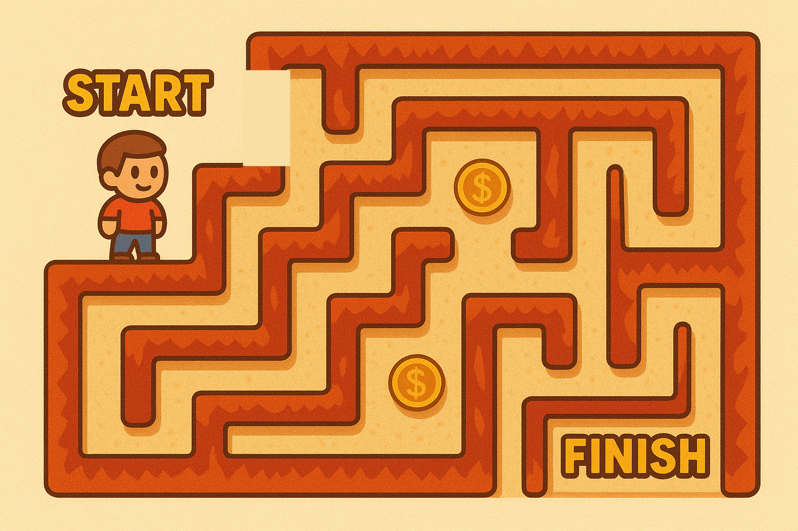

# 🕹 Maze Game 🧭



Играта се развива върху карта с размери 10x10. Играчът започва в горния ляв ъгъл, отбелязан с `@`, и целта му е да достигне до долния десен ъгъл на картата 🏁. Играчът може да се движи по пътеки, отбелязани с `*`, които му позволяват да преминава от една клетка в друга. По пътя си той може да събира монети 💰, обозначени с `$`, като всяка събрана монета увеличава броя на наличните му пари. Въпреки това, картата съдържа и стени, отбелязани с `#`, които представляват пречки 🔥. Ако играчът се сблъска с такава стена, играта приключва и той губи.

Възможни са четири посоки на движение – нагоре, надолу, наляво и надясно, които се контролират чрез въвеждане на съответните букви: **W** за нагоре, **S** за надолу, **A** за наляво и **D** за надясно. Всеки път, когато играчът се премества, картата се обновява и показва новото му местоположение.

Целта на играта е да се съберат възможно най-много монети и да се достигне до долния десен ъгъл на картата, без да се сблъска със стена. Ако играчът успее да премине през всички пречки и стигне до финала, играта завършва с победа.

_Примерен интерфейс:_

```
@ * * # # # # # # # 
$ # * # # # # # # # 
* # * # # # # # # # 
* # * * # # # # # # 
* # # # # # # # # # 
* * # # * * * * $ # 
* # * * * # * # * # 
* # * # # # * # # # 
* * $ $ # # * * $ # 
* # # # # # * $ $ * 
Coins: 0
--------------------------------
S
* * * # # # # # # # 
@ # * # # # # # # # 
* # * # # # # # # # 
* # * * # # # # # # 
* # # # # # # # # # 
* * # # * * * * $ # 
* # * * * # * # * # 
* # * # # # * # # # 
* * $ $ # # * * $ # 
* # # # # # * $ $ * 
Coins: 1
--------------------------------
...
```

