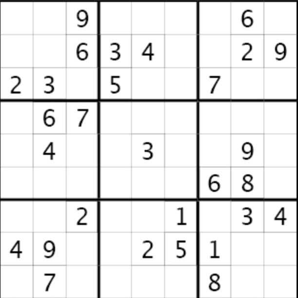

# ✏️ Судоку 🧠



_Стефчо вече не е първа младост и стигна такава възраст, че започна да играе Судоку от вестниците. Тъй като не винаги има вестник под ръка, той иска да играе Судоку на компютъра, за да тренира мозъка си по всяко време. Вашата задача е да му помогнете, като имплементирате конзолна версия на играта Судоку..._

Судоку е игра с квадратна матрица 9×9, в която целта е да се попълнят всички клетки с числа от 1 до 9 така, че на ред, на колона и във своето 3×3 квадратче, всяко дадено число да се среща точно веднъж.

Първоначално на полето ще има няколко фиксирани цифри, които са част от решението и не могат да се променят. Играчът трябва да решава Судоку-то спрямо тях. Всички останали клетки могат да се попълват или променят на всеки ход.

На всеки ход играчът въвежда три числа: индекс на ред, индекс на колона и стойност на цифра, която иска да постави на тази позиция. Ако въведената цифра нарушава правилата на Судоку (повтаря се в реда, колоната или 3×3 подквадратчето), програмата извежда съобщение, че цифрата не може да се постави и играчът трябва да опита друга цифра или да промени друга клетка, за да може да сложи тази цифра на следващ ход. Ако цифрата е валидна, тя се поставя на мястото си веднага.

Играта приключва, когато всички клетки са попълнени и правилата на Судоку са спазени – тогава програмата извежда, че е достигнато решение.

__Примерен интерфейс:__
```
[5]  .   .  | [1]  .   .  | [9] [3]  . 
[4]  .   .  |  .  [7]  .  |  .   .   .
 .   .   .  |  .  [8] [5] |  .  [2] [7]
------------+-------------+------------
[3]  .  [8] |  .  [1] [4] | [6] [9]  . 
[1] [6]  .  |  .   .   .  |  .  [4] [3]
 .  [9] [4] | [6] [3]  .  | [5]  .  [1]
------------+-------------+------------
[8] [5]  .  | [3] [2]  .  |  .   .   . 
 .   .   .  |  .  [5]  .  |  .   .  [6]
 .  [1] [3] |  .   .  [6] |  .   .  [8]

Enter row, column, number: 0 1 2
Added 2 at position (0, 1)
[5]  2   .  | [1]  .   .  | [9] [3]  . 
[4]  .   .  |  .  [7]  .  |  .   .   .
 .   .   .  |  .  [8] [5] |  .  [2] [7]
------------+-------------+------------
[3]  .  [8] |  .  [1] [4] | [6] [9]  . 
[1] [6]  .  |  .   .   .  |  .  [4] [3]
 .  [9] [4] | [6] [3]  .  | [5]  .  [1]
------------+-------------+------------
[8] [5]  .  | [3] [2]  .  |  .   .   . 
 .   .   .  |  .  [5]  .  |  .   .  [6]
 .  [1] [3] |  .   .  [6] |  .   .  [8]

Enter row, column, number: 0 2 7
Added 7 at position (0, 2)
[5]  2   7  | [1]  .   .  | [9] [3]  . 
[4]  .   .  |  .  [7]  .  |  .   .   .
 .   .   .  |  .  [8] [5] |  .  [2] [7]
------------+-------------+------------
[3]  .  [8] |  .  [1] [4] | [6] [9]  . 
[1] [6]  .  |  .   .   .  |  .  [4] [3]
 .  [9] [4] | [6] [3]  .  | [5]  .  [1]
------------+-------------+------------
[8] [5]  .  | [3] [2]  .  |  .   .   . 
 .   .   .  |  .  [5]  .  |  .   .  [6]
 .  [1] [3] |  .   .  [6] |  .   .  [8]

Enter row, column, number: 0 3 1
Invalid move! Position (0, 3) is locked.
[5]  2   7  | [1]  .   .  | [9] [3]  . 
[4]  .   .  |  .  [7]  .  |  .   .   .
 .   .   .  |  .  [8] [5] |  .  [2] [7]
------------+-------------+------------
[3]  .  [8] |  .  [1] [4] | [6] [9]  . 
[1] [6]  .  |  .   .   .  |  .  [4] [3]
 .  [9] [4] | [6] [3]  .  | [5]  .  [1]
------------+-------------+------------
[8] [5]  .  | [3] [2]  .  |  .   .   . 
 .   .   .  |  .  [5]  .  |  .   .  [6]
 .  [1] [3] |  .   .  [6] |  .   .  [8]

Enter row, column, number: 3 0 4
Invalid move! 4 is already present at column 0!

[5]  2   7  | [1]  .   .  | [9] [3]  . 
[4]  .   .  |  .  [7]  .  |  .   .   .
 .   .   .  |  .  [8] [5] |  .  [2] [7]
------------+-------------+------------
[3]  .  [8] |  .  [1] [4] | [6] [9]  . 
[1] [6]  .  |  .   .   .  |  .  [4] [3]
 .  [9] [4] | [6] [3]  .  | [5]  .  [1]
------------+-------------+------------
[8] [5]  .  | [3] [2]  .  |  .   .   . 
 .   .   .  |  .  [5]  .  |  .   .  [6]
 .  [1] [3] |  .   .  [6] |  .   .  [8]

Enter row, column, number: 0 2 6
Added 6 at position (0, 2)
[5]  2   6  | [1]  .   .  | [9] [3]  . 
[4]  .   .  |  .  [7]  .  |  .   .   .
 .   .   .  |  .  [8] [5] |  .  [2] [7]
------------+-------------+------------
[3]  .  [8] |  .  [1] [4] | [6] [9]  . 
[1] [6]  .  |  .   .   .  |  .  [4] [3]
 .  [9] [4] | [6] [3]  .  | [5]  .  [1]
------------+-------------+------------
[8] [5]  .  | [3] [2]  .  |  .   .   . 
 .   .   .  |  .  [5]  .  |  .   .  [6]
 .  [1] [3] |  .   .  [6] |  .   .  [8]


...

Enter row, column, number: 8 7 5
Added 5 at position (8, 7)
[5]  8   7  | [1]  6   2  | [9] [3]  4 
[4]  2   1  |  9  [7]  3  |  8   6   5
 6   3   9  |  4  [8] [5] |  1  [2] [7]
------------+-------------+------------
[3]  7  [8] |  5  [1] [4] | [6] [9]  2 
[1] [6]  5  |  2   9   8  |  7  [4] [3]
 2  [9] [4] | [6] [3]  7  | [5]  8  [1]
------------+-------------+------------
[8] [5]  6  | [3] [2]  1  |  4   7   9 
 7   4   2  |  8  [5]  9  |  3   1  [6]
 9  [1] [3] |  7   4  [6] |  2   5  [8]

Congratulations! You have solved this Sudoku!
```

